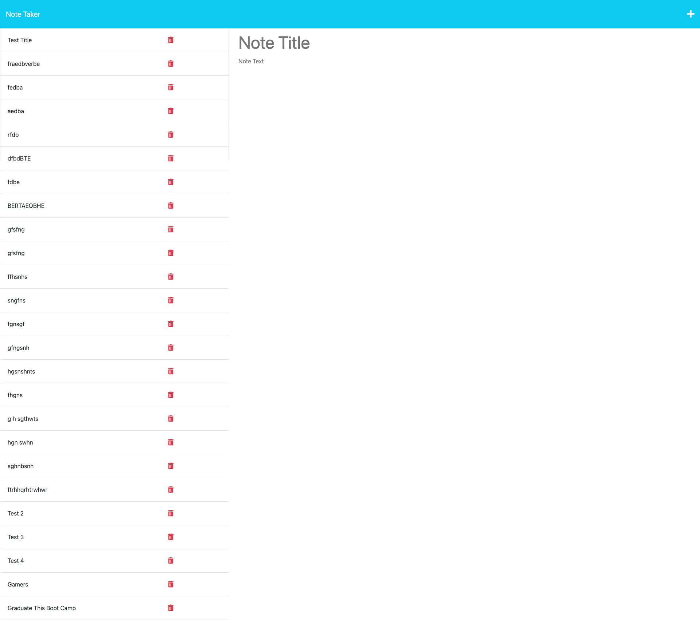

# Best-Note-Taker-4452

## Description
Note taking app to keep track of the topics learned in class

## Table of Contents 

* [Installation](#installation)
* [Usage](#usage)
* [Credits](#credits)
* [Screenshot](#screenshot)
* [Questions](#questions)

## Installation
N/A

## Usage
When a user reaches the website, they can click on the get started button. Then user will then be able to click the "Note Title" and enter the title for their note. The user will then be able to click the note text field to enter the content that they would like to refer to later. Thanks to this app, the user will be making straight A's in no time.

## Credits
N/A

## Screenshot

## Questions
Here is a link to my Github account:
[Bmoore4452](https://github.com/Bmoore4452)

Please feel free to contact me at r.moore803@gmail.com with instructions on how to reach me with additional questions

